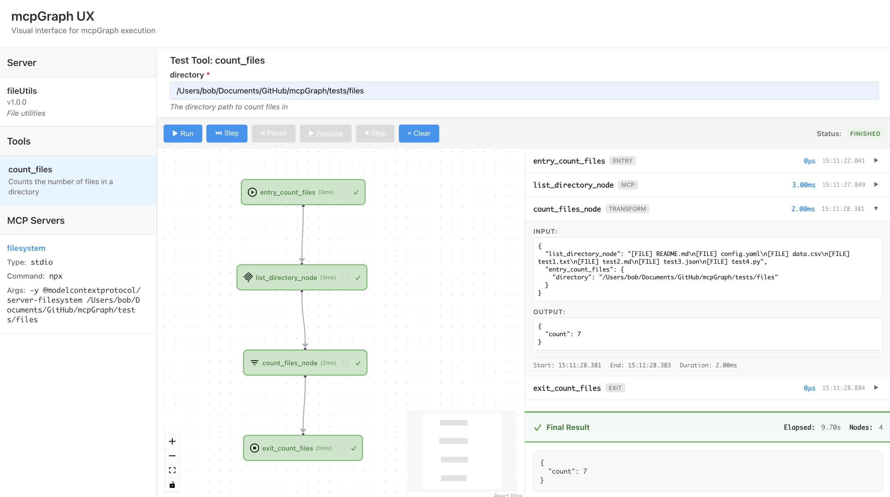

# mcpGraph UX

A Next.js application that provides a visual interface for the [mcpGraph](https://github.com/TeamSparkAI/mcpGraph) npm module. This application allows you to:

- **Visualize graphs**: View your mcpGraph configuration as an interactive graph using React Flow
- **List tools**: See all available MCP tools defined in your graph configuration
- **Test tools**: Execute tools with custom parameters and view results from the exit node



## Features

- 🎨 **Graph Visualization**: Interactive graph visualization using React Flow, showing all nodes and their connections
- 🔧 **Tool Testing**: Test each MCP tool with a user-friendly form interface
- 📊 **Real-time Results**: View execution results directly in the UI
- 🎯 **Tool Filtering**: Filter graph visualization by selected tool

## Prerequisites

- Node.js >= 20.0.0
- The mcpGraph module (should be in `../mcpGraph` relative to this project)

## Installation

1. Install dependencies:

```bash
npm install
```

2. Ensure the mcpGraph module is built and available at `../mcpGraph`

## Usage

Start the server with a port and path to your mcpGraph YAML configuration file:

```bash
npm run server <port> <config-path>
```

### Examples

```bash
# Run on port 3000 with example config
npm run server 3000 ../mcpGraph/examples/count_files.yaml

# Run on port 8080 with custom config
npm run server 8080 /path/to/your/graph.yaml
```

The server will:
1. Load and validate the mcpGraph configuration
2. Start the Next.js server on the specified port
3. Make the configuration available through API routes

Once running, open your browser to `http://localhost:<port>` to access the UI.

## Development

For development with hot-reloading:

```bash
npm run dev
```

Note: In development mode, you'll need to set the `MCPGRAPH_CONFIG_PATH` environment variable:

```bash
MCPGRAPH_CONFIG_PATH=/path/to/config.yaml npm run dev
```

## Project Structure

```
.
├── app/                    # Next.js app directory
│   ├── api/               # API routes
│   │   ├── tools/         # Tool listing and execution endpoints
│   │   └── graph/         # Graph data endpoint
│   ├── layout.tsx         # Root layout
│   ├── page.tsx           # Main page
│   └── globals.css        # Global styles
├── components/            # React components
│   ├── GraphVisualization.tsx  # React Flow graph component
│   ├── ToolList.tsx       # Tool sidebar component
│   └── ToolTester.tsx    # Tool testing form component
├── server.ts             # Custom server entry point
└── package.json          # Dependencies and scripts
```

## API Endpoints

- `GET /api/tools` - List all available tools
- `GET /api/tools/[toolName]` - Get information about a specific tool
- `POST /api/tools/[toolName]` - Execute a tool with provided arguments
- `GET /api/graph` - Get graph structure (nodes and edges) for visualization

## Design

This application follows the design recommendations from the mcpGraph project:

- **React Flow** for graph visualization (as recommended in the design docs)
- **Next.js** for the web framework
- **TypeScript** for type safety

## License

MIT

## TODO

Validate running graph (deal with cwd issue so we can run file_utils)

Would be nice to be able to inspect nodes in graph